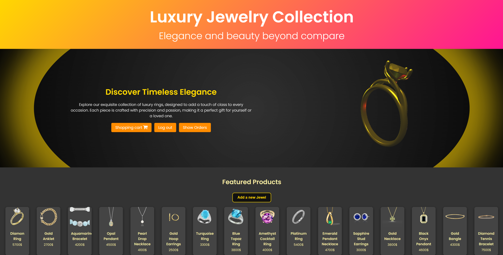
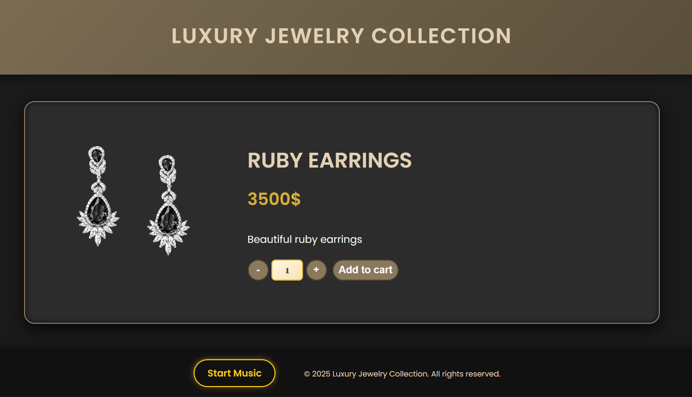
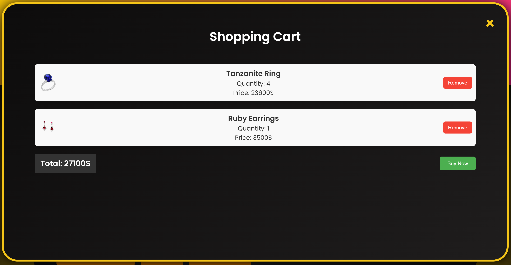
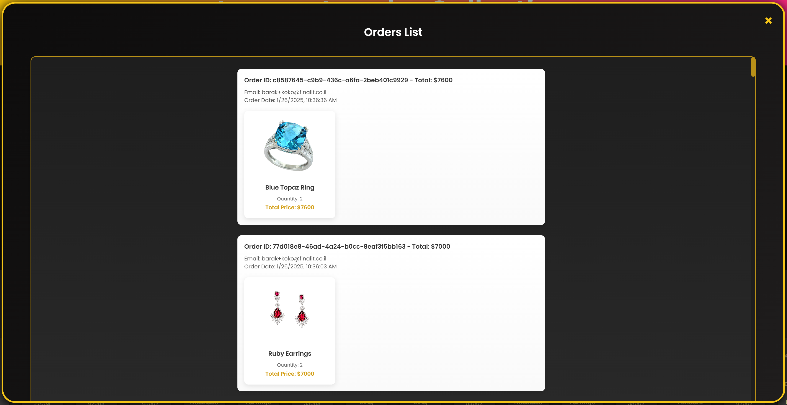

# AWS Serverless E-Commerce Platform

A cloud-native, serverless web application developed for a luxury jewelry brand using AWS services.  
The platform enables browsing products, managing user authentication, processing orders, and delivering real-time notifications — all without managing any servers.

🔗 **Live Demo:** [Click here to view the project](https://diamondluxe.s3.us-east-1.amazonaws.com/index.html)

## ✅ Features

### 👤 User Features
- Sign up and log in securely with AWS Cognito
- Browse and purchase luxury jewelry
- Add items to a shopping cart
- View personal order history
- Receive email notifications upon registration and successful purchase

### 🛠️ Admin Features
- View all customer orders across the platform
- Add new jewelry items to the catalog

## 🛠️ Tech Stack

- **Frontend:** HTML, CSS, JavaScript (static files)
- **Backend:** AWS Lambda (Python), API Gateway
- **Authentication:** AWS Cognito
- **Database:** DynamoDB
- **Notifications:** Amazon SNS
- **Hosting:** AWS S3

## 📁 Project Structure

This project was built entirely using the AWS Console, without a local codebase or infrastructure-as-code setup.

- **Frontend:** Static files hosted on Amazon S3  
- **Backend:** AWS Lambda functions created and edited via AWS Console  
- **API Management:** Amazon API Gateway  
- **Authentication:** AWS Cognito  
- **Database:** DynamoDB  
- **Notifications:** Amazon SNS

## 📸 Screenshots

### 🛍️ Product View

### 🛒 Shopping Cart

### 📦 Admin Orders Page

## 👤 Author

Developed by [Barak Doron](https://github.com/barakdo)
